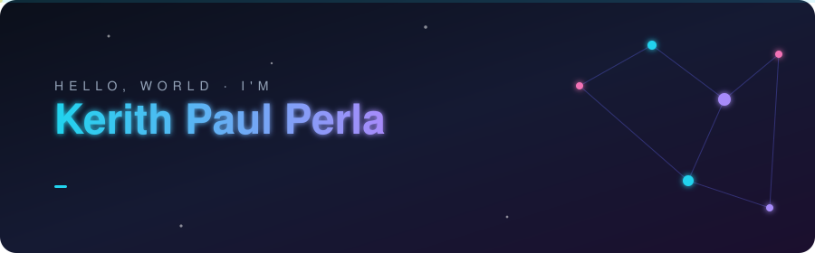
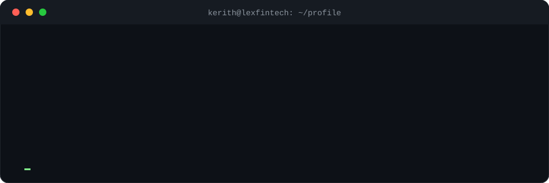
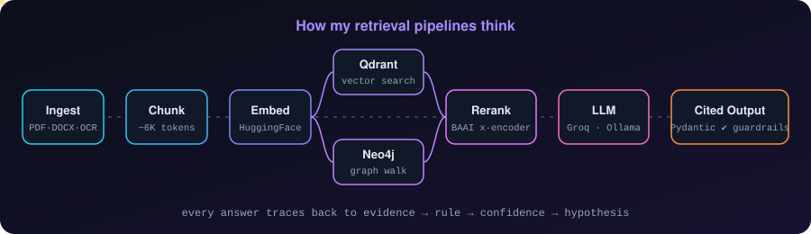

 

---

## ⚡ About me

I'm an **AI Developer at [LexFintech](https://lexfintech.com)** (since Jul 2025) building legal-tech systems that actually survive production: RAG pipelines with hallucination control, multi-agent workflows, and microservice platforms law firms use daily.

- 🔭 Currently building **AI services for LawyerOffice ERP**: SSE-streamed summarizers, OCR + translation, ID-document extraction
- 🧠 I reverse-engineer production AI architectures (RAG, agent frameworks, memory systems) for fun
- 🛡️ **Certified Ethical Hacker (CEH v12)** — I think about guardrails and attack surface before I ship
- 🎓 B.Tech @ DVR & Dr. HS MIC College of Technology (2021–2025)

---

## 🧰 Tech arsenal

<b>🔍 Full skill map (click to expand)</b>

 

| Domain | Tools |
|---|---|
| **Languages** | Python · SQL |
| **AI / ML** | ML · Deep Learning · NLP · RAG · LLMs · Generative AI · Scikit-Learn · TensorFlow · PyTorch · Keras · OpenCV · HuggingFace |
| **Agentic AI** | Multi-Agent Systems · Harness Engineering · Agentic Loop Engineering · Context Engineering · Prompt Engineering · Tool Use / Function Calling · LLM Evaluation & Guardrails |
| **Backend** | FastAPI · LangChain · LangGraph · MCP · n8n · WebSockets |
| **Data & Infra** | Qdrant · Redis · Neo4j · Docker · Git · GitHub |

---

## 🧬 How my pipelines think

---

## 🚀 Featured work

<table>
<tr>
<td width="50%" valign="top">

### 🏗️ ArchitectOS
**AI-powered SEO / AEO / GEO optimization platform**

`Python` `FastAPI` `Next.js` `LangChain` `Qdrant` `Neo4j`

- Ingests GitHub repos, WordPress sites and live URLs into one unified **Website Model**
- **Hybrid RAG**: Qdrant vectors + Neo4j graph traversal + BAAI cross-encoder reranking
- **Seven-agent** system (Research · SEO · AEO · GEO · Code · Platform · Reviewer) driven by an **Evidence Engine**
- Safety-first changes: Docker sandbox, Playwright/Lighthouse checks, **semantic rollback** across Git, WP revisions and AST changes

</td>
<td width="50%" valign="top">

### 🥻 Saree Virtual Try-On
**Pose-aware generation with diffusion-based fabric polish**

`PyTorch` `Stable Diffusion` `ControlNet` `SegFormer`

- Dresses a fixed studio model in an uploaded saree across **3 poses**; face, hands, hair, background stay untouched
- rembg + **SegFormer B2** segmentation, LAB shading extraction, body / border / pallu zones
- Piecewise affine warp + shading transfer, then a light **SD (Realistic Vision + ControlNet Tile)** polish on the garment crop only
- Automated quality gates; tuned for a **4 GB GPU**

</td>
</tr>
</table>

---

## 🏢 What I've shipped at LexFintech

| 🔧 System | 💥 Impact |
|---|---|
| **AI legal notice generator** (FastAPI, HF, Groq, Ollama, RAG, Pydantic) | Citation-backed notices and applicable-section recommendations for high-volume advocates |
| **Multi-agent lead qualification** (LangChain + LangGraph) | Automated triage of unstructured client inquiries across multiple intake channels |
| **LawyerOffice ERP** (NestJS, Next.js 16, Prisma, MySQL) | Independently deployable modules, RS256 JWT zero-trust mesh across every service |
| **Legal filing summarizer** (FastAPI + Groq, SSE) | 50+ page filings → ~6K-token chunks → 5 structured sections (obligations, deadlines, risk flags) |
| **OCR + translation module** (Mistral OCR) | Native PDF/DOCX + scanned docs, English ⇄ Indian languages |
| **ID extraction pipeline** (Aadhaar, PAN, Voter ID, DL, Passport) | Auto-fills client onboarding, no manual re-entry |

---

## 🏆 Certifications

---

## 📊 GitHub stats

  

---

*"Make it work, make it safe, make it reversible."*

